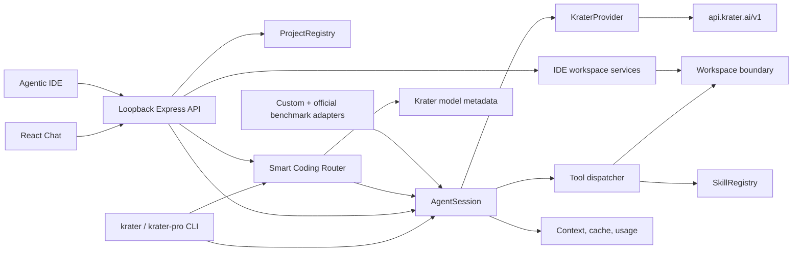

# Architecture

## Shared engine

`src/agent.ts` owns the bounded provider/tool loop, conversation history,
approval requests, read-cache invalidation, usage totals, and stream events.
The CLI and every browser session instantiate this same class. IDE and Chat
views render the same browser session; changing the view does not create a
second conversation or agent.

## Provider

`src/provider.ts` adapts the OpenAI-compatible Krater API. It assembles streamed
text and partial tool-call arguments, supports parallel calls, requests usage
chunks, maps common HTTP failures, and performs model discovery.

## Smart routing

`src/router.ts` deterministically classifies task complexity, risk, context, and
tool requirements, normalizes live model pricing/capability/quality metadata,
computes an accuracy/cost Pareto frontier, and chooses the cheapest eligible
candidate meeting the target quality. `src/model-selection.ts` enforces the
boundary between automatic and explicit selection, including a visible Kimi K3
fallback when live metadata is unavailable. Explicit IDs bypass catalog loading.

CLI conversations route lazily on their first prompt. Browser sessions route
their first automatic message and emit an SSE audit event. In both cases the
resolved model is fixed for the conversation.

## Workspace and tools

`src/workspace.ts` resolves the physical workspace root and checks both lexical
and real paths. It implements file reads/searches/edits, project mapping, Git
reads, and bounded child commands. `src/tools.ts` supplies stable JSON schemas,
classifies mutations, validates arguments, and converts results into model
messages.

## Skills and efficiency

`src/skills.ts` discovers built-in and workspace skills, parses minimal metadata,
and confines on-demand resources. `src/efficiency.ts` provides deterministic
keys, tool-output normalization, turn-aware context selection, and usage
aggregation.

## GUI server

`src/server.ts` stores browser sessions and approvals in memory, exposes SSE,
cancels pending work on disconnect, hashes model-cache keys, serves the
production bundle, and rejects public binds. The browser never receives the
server’s API key. Every API request must present the random local-session token
established by the loopback page, and Host/Origin checks reject cross-site use.

`src/projects.ts` owns the server-run project registry. It resolves local
folders to physical paths, creates scratch workspaces under `.krater/scratch`,
and clones only canonical public GitHub HTTPS URLs with a noninteractive,
isolated Git configuration. Each browser session captures the current project
path at creation. Changing projects is blocked during active work and disposes
all older sessions before new work can begin.

## Agentic IDE

`web/src/AgenticIde.tsx` presents the selected project as an Explorer, tabbed
UTF-8 editor, bounded terminal, read-only Git panel, and embedded agent. **Ask
Krater** transfers selected editor context into the same composer used by Chat;
the model then follows the ordinary routing, tools, and approval flow.

The direct IDE endpoints in `src/server.ts` use one server-owned `Workspace`
instance for the currently selected project:

- tree and document reads return the current `projectId`;
- saves require that ID plus the `sha256:` revision returned by the read;
- Git status/diff is pinned to a repository contained by the workspace; and
- terminal requests require the project ID and use the same command guards,
  minimal environment, timeout, cancellation, and output limits as agent
  commands.

Project selection cannot change while an editor, Git, terminal, or agent
operation is active. A successful change replaces the IDE workspace and
disposes existing agent sessions. This operation gate and the `projectId`
checks prevent a request created for one root from being applied to another.

Editor revisions implement optimistic concurrency. `Workspace` serializes
writes per destination, compares the saved byte digest, and publishes through
its atomic-write path. A stale save returns a conflict rather than overwriting
an agent, terminal, or external edit. After an agent turn, the client refreshes
the tree, Git state, and only tabs without unsaved local changes.

The user-entered terminal is not routed through model approval because pressing
Run is the explicit human execution request. On macOS, `Workspace` uses
`/usr/bin/sandbox-exec` when available to confine writes and deny protected
credential paths. Other systems retain process, command, secret, environment,
workspace, and resource controls but do not gain an OS sandbox.

## Benchmarks

`benchmarks/schema.ts` strictly validates the catalog. `benchmarks/run.ts`
defaults to offline validation, requires explicit paid-run selectors, creates a
fresh isolated workspace per task, withholds independent checkers from the
agent, captures evidence, redacts credentials, and writes JSON plus Markdown
reports. In automatic mode it resolves one model before the selected run so
every task in that report uses the same model for comparability.

The DeepSWE, SWE-bench Pro-os, and SWE-Atlas adapter directories translate the
same built agent into their official container/orchestrator contracts. Their
offline validation and infrastructure results are intentionally reported
separately from official evaluator rewards. See
[BENCHMARKS.md](BENCHMARKS.md).
