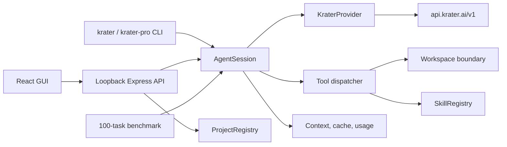

# Architecture

## Shared engine

`src/agent.ts` owns the bounded provider/tool loop, conversation history,
approval requests, read-cache invalidation, usage totals, and stream events.
The CLI and every browser session instantiate this same class.

## Provider

`src/provider.ts` adapts the OpenAI-compatible Krater API. It assembles streamed
text and partial tool-call arguments, supports parallel calls, requests usage
chunks, maps common HTTP failures, and performs model discovery.

## Workspace and tools

`src/workspace.ts` resolves the physical workspace root and checks both lexical
and real paths. It implements file reads/searches/edits, project mapping, Git
reads, and bounded child commands. `src/tools.ts` supplies stable JSON schemas,
classifies mutations, validates arguments, and converts results into model
messages.

## Skills and efficiency

`src/skills.ts` discovers built-in and workspace skills, parses minimal metadata,
and confines on-demand resources. `src/efficiency.ts` provides deterministic
keys, tool-output normalization, turn-aware context selection, and usage
aggregation.

## GUI server

`src/server.ts` stores browser sessions and approvals in memory, exposes SSE,
cancels pending work on disconnect, hashes model-cache keys, serves the
production bundle, and rejects public binds. The browser never receives the
server’s API key.

`src/projects.ts` owns the server-run project registry. It resolves local
folders to physical paths, creates scratch workspaces under `.krater/scratch`,
and clones only canonical public GitHub HTTPS URLs with a noninteractive,
isolated Git configuration. Each browser session captures the current project
path at creation. Changing projects is blocked during active work and disposes
all older sessions before new work can begin.

## Benchmark

`benchmarks/schema.ts` strictly validates the catalog. `benchmarks/run.ts`
defaults to offline validation, requires explicit paid-run selectors, creates a
fresh isolated workspace per task, withholds independent checkers from the
agent, captures evidence, redacts credentials, and writes JSON plus Markdown
reports.
